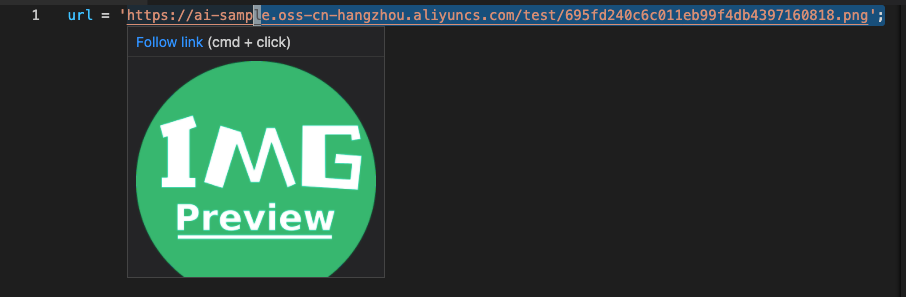

# image-hover-preview

Vscode 图片悬停预览插件。

**!!不支持非`https`图片**

## Install

在 `vscode` 中搜索 `Image Preview`，标题为 `Image Hover Preview` 的那个


## Usage

安装插件后，在图片地址上悬停时即可预览该图片，支持网络图片。



## Contribute

`clone` 项目后安装依赖，启动开发即可

```bash
yarn start
```

进入 `debug` 面板，点击 `Run Extension` 即可开始调试。

## Publish

