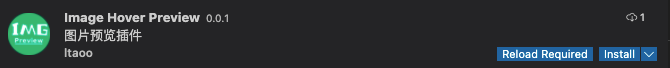

# image-hover-preview

Vscode 图片悬停预览插件。

1. 支持悬停在地址上预览图片
2. 支持展示图片尺寸与大小

**!!不支持非`https`图片**

## Install

在 `vscode` 中搜索 `Image Preview`，标题为 `Image Hover Preview` 的那个



## Usage

安装插件后，在图片地址上悬停时即可预览该图片，支持网络图片。


## Contribute

`clone` 项目后安装依赖，启动开发即可

```bash
yarn start
```

进入 `debug` 面板，点击 `Run Extension` 即可开始调试。

## Todo

1、支持配置忽略指定路径图片

```json
{
  "imageHoverPreview.ignore": {
    "type": "array",
    "items": {
      "type": "string"
    },
    "default": [],
    "description": "The image path need ignore."
  }
}
```

2、绝对路径图片的识别

现在因为会误识别，所以对绝对路径的识别是去掉的，如 `<div>hello</div>`，这里的 `/div>` 就容易被识别为图片。

3、支持自适应预览时的大小

有些图片比较大，单纯限制宽度会导致图片还是看不清，可以根据图片真实宽高自适应展示的图片宽高。

4、支持预览 http 协议图片

由于 `vscode` 自身的限制，`http` 协议图片是无法预览的。
